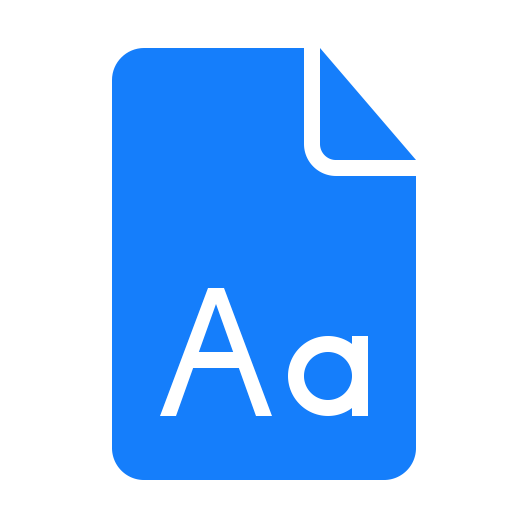
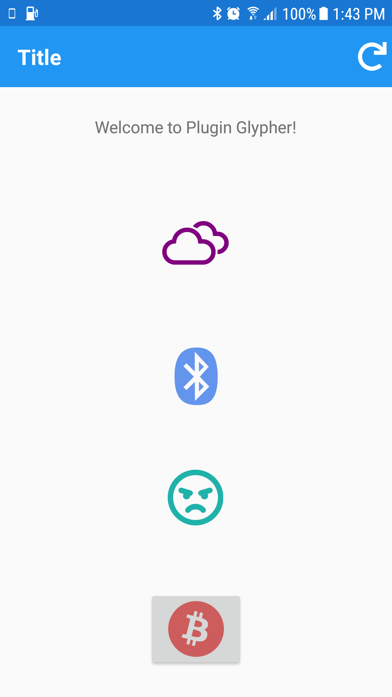
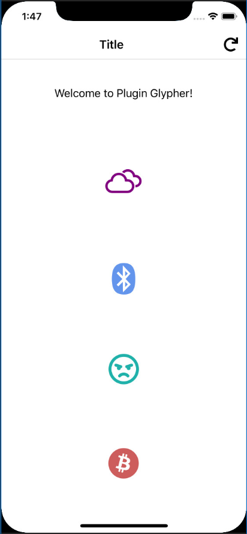

# Using Xamarin Embedded fonts and Font Image Source, What this plugging was trying to achieve can be achieved now. 

https://docs.microsoft.com/en-us/xamarin/xamarin-forms/user-interface/text/fonts#use-a-custom-font
https://docs.microsoft.com/en-us/xamarin/xamarin-forms/user-interface/text/fonts#display-font-icons

If you are using Xamarin.Forms 4.5.0.530 below version, it still make sense to use this pluging. 



[](https://ci.appveyor.com/project/tmt242001/plugin-glypher)

# Plugin.Glypher
This plugin extend support for font glyphs (font icons) in Xamarin.Forms applications.

# Usage

```XML
xmlns:fontAwesome5Free="clr-namespace:Plugin.Glypher.FontAwesome5Free;assembly=Plugin.Glypher.FontAwesome5Free"
xmlns:glypher="clr-namespace:Plugin.Glypher;assembly=Plugin.Glypher"

<Label glypher:FontGlyph.Glyph="{x:Static fontAwesome5Free:GlyphListBrand.Fab_Bluetooth}"
       FontSize="Large"
       TextColor="CornflowerBlue" />
       
<Button glypher:FontGlyph.Glyph="{x:Static fontAwesome5Free:GlyphListBrand.Fab_Bitcoin}"
        FontSize="Large"
        TextColor="IndianRed" />

<Image>
    <Image.Source>
        <FontImageSource Size="32" 
                         Color="Orange" 
                         glypher:FontGlyph.Glyph="{x:Static fontAwesome5Free:GlyphListRegular.Far_Bell_Slash}" />
    </Image.Source>
</Image>
```       

# Setup

- `Plugin.Glypher` [](https://www.nuget.org/packages/Plugin.Glypher/) Available on NuGet: https://www.nuget.org/packages/Plugin.Glypher

`Plugin.Glypher` is not required to be reference if using any other package.
- Install selected nuget(s) into any .NET Standard 2.0 projects required for your app. No need to install it in your platform specific projects.

|Package|Wiki|Nuget|Android|iOS|
|-------|----|-----|-------|---| 
|`Plugin.Glypher.FontAwesome5Free`|[Font Awesome 5 Free](../../wiki/Font-Awesome-5-Free)|[](https://www.nuget.org/packages/Plugin.Glypher.FontAwesome5Free/)|Yes|Yes|
|`Plugin.Glypher.FontAwesome5Pro`|[Font Awesome 5 Pro](../../wiki/Font-Awesome-5-Pro)|[](https://www.nuget.org/packages/Plugin.Glypher.FontAwesome5Pro/)|Yes|Yes|
|`Plugin.Glypher.WeatherIcons`|[Weather Icons](../../wiki/Weather-Icons)|[](https://www.nuget.org/packages/Plugin.Glypher.WeatherIcons/)|Yes|Yes|

# Screenshots

|Android|iOS|
|-------|---| 
|||

# SourceLink Support

In Visual Studio, confirm that SourceLink is enabled. 
Also, Turn off "Just My Code" since, well, this isn't your code.

https://docs.microsoft.com/en-us/dotnet/standard/library-guidance/sourcelink

# Contributing

Contributions are welcome.  Feel free to file issues and pull requests on the repo and they'll be reviewed as time permits.

## Icon

Thank you for the Icons by [Yannick Lung](https://www.iconfinder.com/icons/314770/document_font_icon), [Stephen Hutchings](https://www.iconfinder.com/icons/216467/partly_sunny_weather_icon)
